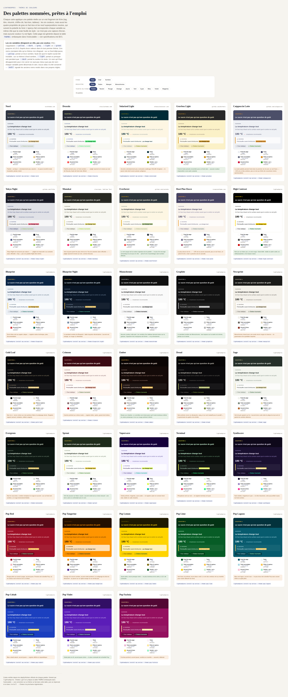

<p align="center">
  
</p>

# LightWebPres

A single-file, dependency-free Python tool that turns an extended Markdown
format into self-contained, scrollable HTML "slide deck" articles — with
series navigation, an index page, and a generated README — deployable to
any static host.

```bash
./lightwebpres install my-series
./lightwebpres demo my-series
./lightwebpres build my-series
# -> my-series/public/index.html
```

No `pip install`, no build step beyond the tool itself, no JavaScript
framework in the output. Python 3.8+ (standard library only); on
Windows, run `python lightwebpres <command>`. Every generated page is inline CSS + inline JS,
one `.html` file, opens straight from disk or any static host.

## Features

- **Typography handled for you.** Non-breaking spaces before punctuation,
  `%`, thousands, and units — applied automatically, never touching what
  you've already written, switchable off per article or globally when
  you don't want it. French and English ship built-in; the mechanism
  isn't French-specific, so adding a language is a matter of writing
  rules, not touching the engine.
- **A simple, three-level structure.** Series → article → slide. Nothing
  to design: pick a slide type (cover, standard, cross-article nav, full
  article), fill in the fields.
- **Styled by template, not by page.** One `templates/style.css`/`nav.js`
  pair drives the whole series — change the look once, every article
  picks it up.
- **Every page stands alone, yet belongs to its series.** Each article is
  one self-contained HTML file — but it carries its own cross-article
  navigation block, generated from the series, so a reader can always get
  back to "the rest of the series" without a framework stitching pages
  together at runtime.
- **Share in one click, at whatever scope you need.** Copyable link or QR
  code, for the whole series, the current article, or the exact slide
  being read — generated entirely client-side.
- **Comes with a companion web page, not just a CLI.** One browser-based
  tool, nothing to install: one tab builds a zip you drop in, the other
  pulls, builds, and pushes straight to a GitLab repository — both
  running the exact same engine as the command line, entirely inside the
  tab.
- **Agent friendly, without being agent-only.** Written and run by hand
  just as naturally as it's scripted: articles are plain Markdown, the
  CLI never blocks on an interactive prompt, and a bundled skill teaches
  the format to any skill-aware agent — so a person with an editor and an
  agent driving a pipeline get the same tool, not two different ones. A
  second skill ships alongside it for one editorial method the format
  suits well; the format doesn't require it, or any other.

## Quickstart

```bash
./lightwebpres install my-series             # scaffold a series directory
./lightwebpres demo my-series --lang en      # generate + build 3 example articles (English UI)
open my-series/public/index.html
```

Then write your own `.md` files in `my-series/articles/`, add a `{"page_source":
"apple-pie.md"}` entry per article to `my-series/series.json` (that's the
only field it needs — see below), and run `build` again.

## The format

Each article is one Markdown file: a metadata block, then a sequence of
"slides" separated by `---`. An article is self-describing — its own
`page_title`/`card_title`/`card_desc`/`nav_title`/`nav_desc` all fall back
to sensible content-derived defaults if left out, and `series.json` only
needs `page_source` per article (see specifications.md §20.3.1); every field
below can be omitted or overridden from `series.json` instead.

```markdown
<!-- lwp:meta -->
page_title: The apple pie<br>What shortcrust pastry actually changes
nav_title: The apple pie
nav_desc: Pastry, baking, and plating
---

<!-- lwp:slide:cover -->
tag: Recipe
# The apple pie
summary: Nine things that make or break a homemade apple pie, from pastry to bake.

---

<!-- lwp:slide -->
tag: Baking
## Temperature changes everything
summary: An oven that's too hot cooks the surface before the center is ready.
fact-label: The takeaway
highlight: 180 °C
highlight-caption: recommended baking temperature for shortcrust pastry
source: Baking guide, 2024 edition.

An oven that's too hot browns the crust while the center stays raw — the
most common mistake in a homemade pie.

---

<!-- lwp:slide:full-article -->
article: apple-pie_article.md
```

The last slide points at a **second** file, `articles/apple-pie_article.md`,
holding the long-form text — `build` fails if it isn't there. Drop the
`full-article` slide if you don't want one.

That builds into a scrollable page: a cover slide inverted against the
page, a fact-card slide
with a highlighted figure, and a full long-form article appended at the
end — plus keyboard/scroll navigation, a "copy link to this slide" button,
and (if there's more than one article) a cross-article navigation block,
all generated automatically.

## Commands

| Command | What it does |
|---|---|
| `install [dir]` | Scaffolds a series directory (`articles/`, `templates/`, `language/`, `series.json`, a copy of the executable, and `.gitlab-ci.yml` if `--gitlab-ci` is passed — opt-in, never assumed) |
| `demo [dir]` | Generates and builds 3 example articles, exercising every slide type and field |
| `build [dir]` | Builds `public/` from `series.json` + `articles/*.md`; `--only file.html` rebuilds just that one article, falling back to a full build automatically if anything that affects `index.html`/navigation changed (see specifications.md §11.3.1) |
| `check [dir]` | Rebuilds in memory and diffs against `public/` — non-zero exit on drift, usable as a CI gate |
| `audit [dir]` | Non-blocking warnings — editorial (e.g. "no cover slide") and technical (palette variables renamed in v0.12.0 still used in your own CSS); never fails the build |
| `refresh-templates [dir]` | Updates the built-in CSS/JS in `templates/` after an executable upgrade, keeping local customizations |
| `themes` | Lists the built-in color themes with their facets; `--polarity`/`--intensity`/`--hue` narrow the list |
| `set-theme [dir] --theme X` | Changes an existing series' theme, reporting what it replaced; `--force` for a stylesheet whose built-in part isn't standard |
| `themes-gallery [path]` | Generates a self-contained HTML page previewing every built-in color theme, with facet filters (default: `themes-gallery.html`) |
| `--help` | Full reference: options, environment variables, slide types, recognized fields |

## Slide types

- **`cover`** — title slide: tag, `# Title`, summary. Free position and
  count — `build` doesn't enforce a layout, `audit` just flags it if you
  want a reminder.
- **`standard`** — tag, `## Title`, summary, an optional highlighted
  figure (`highlight`/`highlight-caption`), and a Markdown fact-box.
- **`series-nav`** — cross-article navigation, generated from
  `series.json` (at most one per article).
- **`full-article`** — includes a separate long-form Markdown file,
  converted with full support for headings, bold/italic, links,
  footnotes, lists, tables, blockquotes, images with captions
  (`` — small, centered, themed; mid-sentence the
  same image stays inline and its title becomes a tooltip),
  inline/fenced code, and inline raw HTML (at most one per article).
  A comparison table's cells can carry `yes` / `no` / `partial` — or
  `col-signal` on a whole column — to be coloured by verdict; written as
  inline HTML, since Markdown has no syntax for it.

Every slide (and `series.json`/the article's own meta block) also
accepts `comment:` — a review note, recognized but never rendered, never
published, not even in the page's raw HTML source.

## Language & typography

Built-in French and English packs (typography rules — non-breaking
spaces, etc. — plus every UI string: nav button tooltips, "copy link",
series navigation labels). `--lang fr|en` picks one; a
`language/{lang}.json` file lets you override just the keys you care
about, falling back to the built-in pack for the rest. English is the
ultimate fallback for any language without a pack.

The French pack automatically upgrades an existing space to a
non-breaking one before `; : ! ?`, after `«`, before `%`, between
thousands-grouped digits (`170 000`, only if the source already spaces it
out), between a number and `million(s)`/`milliard(s)`/`dollar(s)`/`$`, and
after `×`/`≈` before a number — it never inserts spacing or digit
grouping that wasn't already there, and a non-breaking space already in
your source always passes through unchanged. This alters generated
content, so it's controllable at three levels: per-article meta fields
`typo-units: off` / `typo-thousands: off` (just those rules) or `typo:
off` (every rule, that article's page only), and the CLI flag
`--no-typography` on `build`/`check` (every rule, the whole run). See
`--help` or specifications.md §4.5/§7.5/§19.6 for the full list.

## Templates

`templates/style.css` and `templates/nav.js` are read back on every build
if present, replacing the built-in defaults — the page/index HTML
structure itself is fixed, not a template, so a build can't be broken by
a malformed structural override.

Thirty-three named color themes ship pre-configured. Nine borrow known
editor palettes (Nord, Dracula, Solarized, Gruvbox, Catppuccin, Tokyo
Night, Monokai, Everforest, Rosé Pine); the rest are the project's own —
high-contrast and monochrome sets, a red family, a green one, three cyber
palettes, and an eight-strong Pop family whose backgrounds carry the
color themselves. Every project-owned palette was measured before being
kept: AAA contrast for body text, AA for secondary text and accents, 3:1
for rules, and comparison verdicts checked for separability under
simulated deuteranopia and protanopia.

Thirty-three is too many to pick from a list, so themes are found by
facet — **polarity** (light or dark background), **intensity** (sober,
vivid, mono), and **hue**, computed from the background in CIELAB rather
than declared, so it can't drift when a color is tweaked:

```bash
./lightwebpres themes                              # all 33, with their facets
./lightwebpres themes --polarity dark --intensity sober  # just the ones you mean
```

Apply one when scaffolding, or change your mind later:

```bash
./lightwebpres install my-series --theme evergreen
./lightwebpres set-theme my-series --theme crimson
```

`set-theme` reports what it replaced (`Theme changed: evergreen ->
crimson`) and refuses a `templates/style.css` whose built-in part isn't
what this executable would have written — hand-edited, or from another
version — because the substitution could leave it half-recolored;
`--force` overrides that and warns. Rules you appended after the
personalization marker are preserved either way.

A theme substitutes twenty-one CSS custom properties: six palette colors,
six fact-box emphasis properties, and nine translucent overlays for
rules, surfaces and floating controls. The emphasis properties are four
independent axes — weight, italic, highlight, underline — so a theme can
be bold with no highlight, un-bold with a green one, or underlined and
nothing else. Those overlays are what makes a
dark-background theme possible at all — over a dark page a surface veil
has to be white on dark instead of the reverse. Nothing else in the CSS
changes, and the substitution survives an executable upgrade:
`refresh-templates` reapplies the same theme to the refreshed built-in
CSS instead of silently reverting to the default.

Each palette variable is named for **what it does**, not for a color:

| Variable | Role |
|---|---|
| `--page` | the page background |
| `--ink` | body text; also the cover ground on a light theme |
| `--ink-muted` | summary, caption, source, the "no" verdict |
| `--marker` | fact-box rule, cover tag, header underline, active nav dot, emphasized column |
| `--accent` | footnote call, the "partial" verdict, focus ring |
| `--positive` | the "yes" verdict of a comparison table |

A body link is deliberately **not** in that table. It keeps the ink
around it and is signalled by an underline, whose colour a theme may tint
through `--link-decoration-color` (`currentColor` by default). Measured
across all 33 themes: the browser default blue fails AA on fifteen of
them and is invisible on six, while every palette colour that could
replace it is either below AA on a third of the catalogue or is already
one of the three comparison-table verdict colours.

> **Renamed in v0.12.0**, from names that described a colour to names
> that describe a role. The mapping is deliberately spelled out, because
> reading the two lists side by side gets two of them backwards:
>
> | was | is now |
> |---|---|
> | `--yellow` | `--marker` |
> | `--dark` | `--ink` |
> | `--grey` | `--ink-muted` |
> | `--light` | `--page` |
> | `--green` | `--positive` |
> | `--accent` | `--accent` (unchanged) |
>
> They were named after the values they held in the very first theme. The names then lied on every theme that moved away from it:
> `--yellow` held a dark olive on Pop Lemon (a yellow marker on a
> yellow page is invisible), and `--light` held a near-black on every
> dark theme while `--dark` held the text color. No compatibility
> aliases were kept, so `var(--yellow)` in your own rules no longer
> resolves to anything — `lightwebpres audit` names every old variable
> still left in your section of `templates/style.css`, with its
> replacement. The built-in part above the personalization marker
> migrates by itself on the next `refresh-templates`.



That's [`themes-gallery.html`](themes-gallery.html) in this repo,
rendered — open it directly in a browser for the live version, where
those same facets become filters (each card previews the theme against
real slide content: tag, title, summary, a highlighted figure, a
fact-box, a table). It's generated straight from the tool's own `THEMES`
data with `./lightwebpres themes-gallery`, so it can never drift from
what `install --theme` actually applies.

## One browser-based tool, two tabs

For anyone who'd rather not touch a terminal: `web/index.html` is the
same tool as a page in a tab — pick a series (upload a zip, or connect a
GitLab repository), the page builds it, you get the result back, nothing
to install. It loads the exact same `lightwebpres` executable,
unmodified, running inside [Pyodide](https://pyodide.org) (CPython
compiled to WebAssembly) — one build engine, driven from a terminal or a
tab. It needs to be **served over http(s)**, not opened directly as a
`file://` page — browsers block Pyodide's asset loading under that origin
(see specifications.md §23.6 — if you open it as `file://` anyway, it
shows the exact fix command, with a one-click Copy button, computed from
where you actually put the files).

It also needs its own `vendor/`/`app.py`/`git_sync.py`, plus a copy of
`lightwebpres` itself — never duplicated by default, since it stays the
single source of truth — found in one of two conventional spots relative
to the page, tried in that order: **`./lightwebpres`** (dropped alongside
`web/`'s own contents — the layout for a real site that serves `web/` as
its own URL root, no extra path segment needed) or **`../lightwebpres`**
(the repo's own layout, one level up, for a deployment that's just a
straight copy of the repo). Local testing from the repo: `python3 -m
http.server 8000 --directory /path/to/lightwebpres` (the folder
containing both `lightwebpres` and `web/`), then open
`http://localhost:8000/web/index.html`. Self-hosting on a real web server
(Apache/nginx) can also hit a `.mjs` MIME type issue — see
specifications.md §23.7 for the fix (`web/.htaccess` handles it
automatically on Apache where allowed).

- **Upload a zip** — drop a zip of your series, get back a zip of
  `public/`. Nothing ever leaves the browser tab; Pyodide runs vendored
  locally, not from a CDN.
- **Sync with GitLab** — pull a series straight from a GitLab repository,
  build it, push the result back as a single commit. Talks directly to
  the GitLab instance you configure (no third-party proxy in the request
  path); never deletes a file on push, only creates/updates.

Both tabs share one Pyodide/`lightwebpres` load at page start, so
switching between them is instant — no separate page, no reload.

## Safety

- Fatal validation for every structurally dangerous input: duplicate or
  missing required slides, unsafe file paths in `series.json`/`article:`
  (rejects anything that isn't a plain filename — no directory traversal),
  malformed JSON.
- Typography rules are applied to already-assembled HTML but can never
  touch tag syntax — text and markup are split before any rule runs.
- Every generated page is checked for HTML tag balance before being
  written; a rendering bug never silently ships a broken page.

## Testing

```bash
python3 tests/run_tests.py
```

100+ black-box tests exercising the CLI as a subprocess, plus real headless-
Chromium end-to-end tests (via Playwright, skipped cleanly if unavailable)
for both tabs of the browser-based tool.

## Project layout

```
lightwebpres          # the executable — the only thing you need to run this
specifications.md     # full reference specification (French)
themes-gallery.html   # preview of every built-in color theme (generated, see below)
themes-gallery.png    # a rendered snapshot of the above, for this README
web/                  # the browser-based build tool (upload-a-zip and GitLab-sync tabs)
agent/skills/         # two packaged skills: the article format, and one optional editorial method
tools/                # maintenance scripts (regenerating the gallery snapshot above)
tests/                # regression suite
```

## Reference

| Document | What it is |
|---|---|
| [`GUIDE.md`](GUIDE.md) | **Start here.** The walkthrough, in English: install, build, choose a look, write, verify, ship |
| [`GLOSSARY.md`](GLOSSARY.md) | Every field, its default, and where it falls back from |
| [`agent/skills/lightwebpres/SKILL.md`](agent/skills/lightwebpres/SKILL.md) | The exact article format — written for an agent, readable by a person |
| [`agent/skills/sourced-presentation/SKILL.md`](agent/skills/sourced-presentation/SKILL.md) | One method the format suits — a sourced deck backed by a fully referenced article. Optional: nothing here is required to use LightWebPres |
| [`BACKLOG.md`](BACKLOG.md) | Known gaps and deferred decisions |


`specifications.md` is the complete, detailed specification (in French) —
directory layout, `series.json` schema, parser edge cases, full
placeholder reference, and more.

## License

Not yet set. `web/vendor/pyodide/` is vendored third-party code (Mozilla
Public License 2.0) — see `web/vendor/NOTICE.md`.

## Troubleshooting

**`./lightwebpres: Permission denied`** (Linux/macOS)
The executable bit didn't survive however you got the file (some zip
tools, some transfer methods). Fix it once:

```bash
chmod +x lightwebpres
```

**`./lightwebpres: command not found`** (Linux/macOS)
`lightwebpres` isn't installed system-wide, so it needs either the `./`
prefix when run from the directory it's in, or its full/relative path.
Running it by bare name only works if that directory is on your `PATH`.

**Windows**
Windows doesn't understand the `#!/usr/bin/env python3` line at the top
of the file, so `lightwebpres` (or `.\lightwebpres`) won't launch on its
own. Run it through Python explicitly instead:

```powershell
python lightwebpres install my-series
```

If that's not found, try the `py` launcher (bundled with most Windows
Python installs):

```powershell
py lightwebpres install my-series
```

**`python3: command not found`**
Some systems only have `python` on `PATH`, not `python3` (common on
Windows, occasionally macOS). Use `python` instead of `python3` in any
command above that invokes it explicitly — e.g. `python -m http.server`
when serving the [browser-based tool](#one-browser-based-tool-two-tabs).
